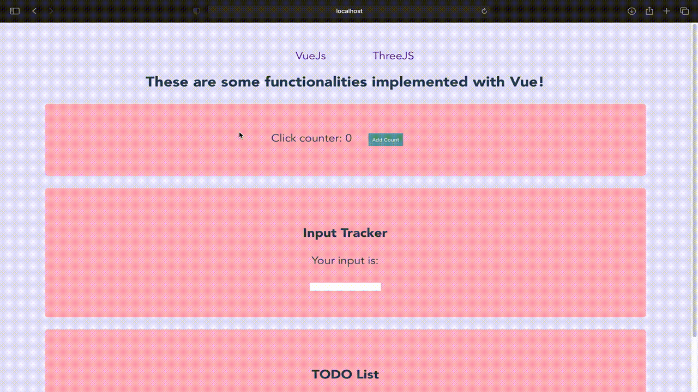
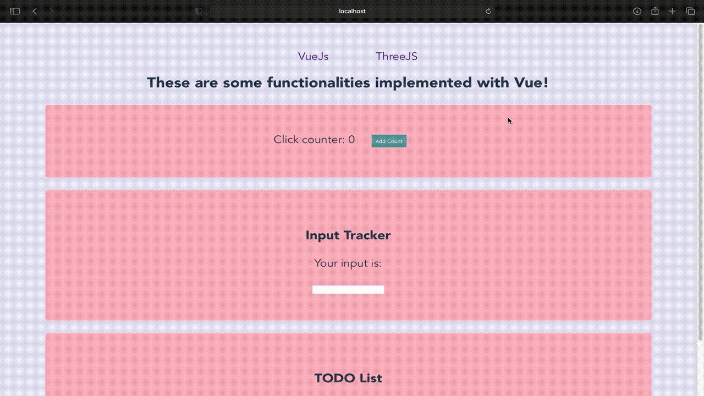
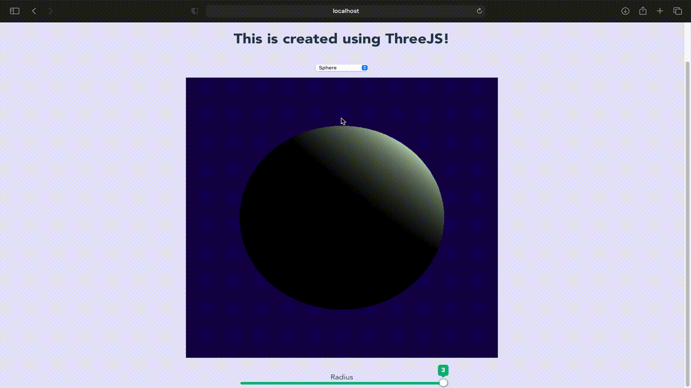

# VueThreeJS

A simple project to learn the basics of VueJS and ThreeJS

## VueJS

* Reactive data component update: Clicker counting
* Form input binding using v-model: Input tracker
* Simple list rendering using v-for: TODO List



## ThreeJS

* Renderer and camera with orbit control 
* Box and Sphere geometry with customisable dimensions
* Point lighting for clearer 3D effect





# Setting Up
Clone the repository and install `Node.js`. Then run:
```
npm install
npm run serve
```
